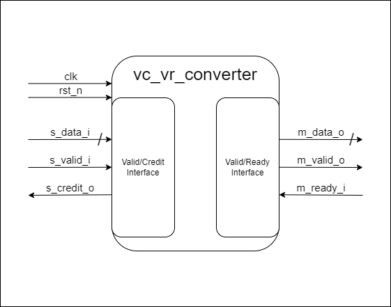
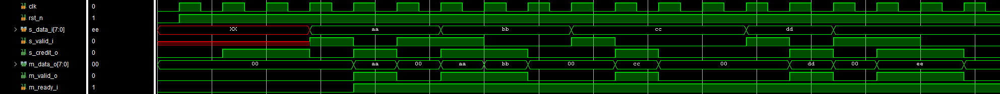
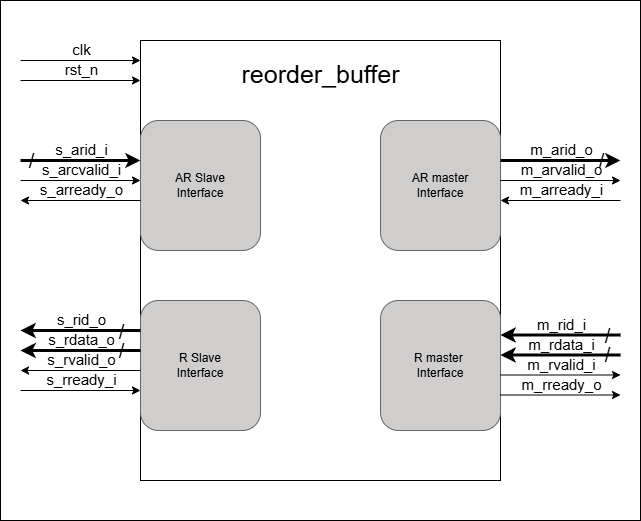
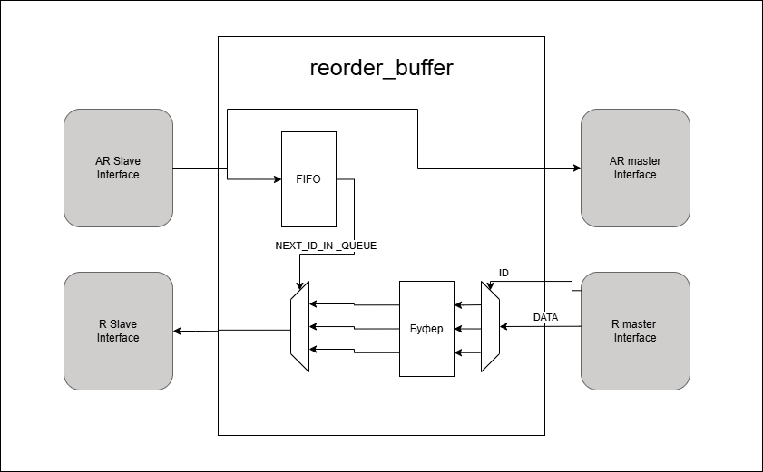
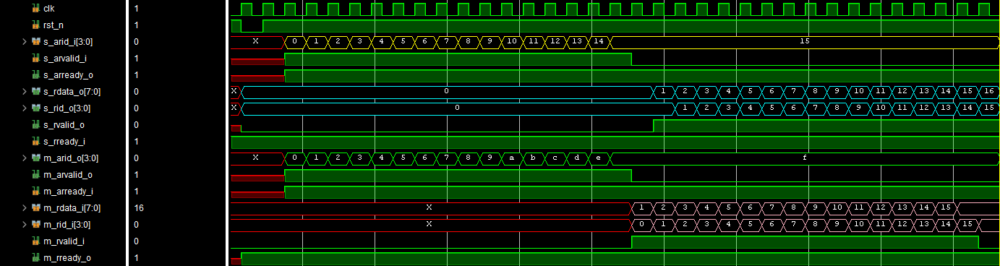
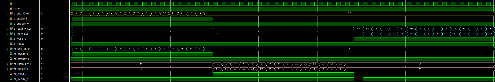
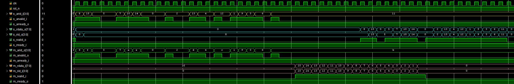

# Пояснение
Данный READE файл содержит в себе описание решения обоих вариантов тестового задания в команду интерконнект.

## Структура проекта

```
- interconnect_test
|- img  - файл со схемами и времянками
|- var1 - файл с кодом на SystemVerilog и testbench для 1-го варианта
|- var2 - файл с кодом на SystemVerilog и testbench для 2-го варианта
```

# Преобразователь valid/credit интерфейса в valid/ready интерфейс (Вариант 1)



## Описание задачи

Реализовать приёмную часть модуля, конвертирующего интерфейс valid/credit в valid/ready, с соблюдением следующих требований:

- Принимать данные по сигналу s_data_i только при s_valid_i = 1 и наличии доступных кредитов, иначе данные должны игнорироваться.
- После снятия сброса необходимо восстановить внутренний счётчик кредитов до CREDIT_NUM и выдать кредиты master-устройству через импульсы на s_credit_o (по одному за такт).
- Обеспечить корректную передачу кредитов и исключить возможность приёма данных от master-устройства при отсутствии доступных кредитов.

## Принятые проектные решения

Из поставленной задачи стало понятно что нужно реализовать запись и хранение данных, т.к. у меня уже был готов модуль FIFO, я решил использовать его. Было принято решение использовать счётчик для первоначального отображения количества свободных кредитов. После первоначальной инициализации, сигнал `s_credit_o` поднимается только при чтении данных.

## Интерфейс модуля

```verilog
module vc_vr_converter #(
  parameter DATA_WIDTH = 8,
            CREDIT_NUM = 2
)(
  input  logic                  clk,
  input  logic                  rst_n,
  //valid/credit interface
  input  logic [DATA_WIDTH-1:0] s_data_i,
  input  logic                  s_valid_i,
  output logic                  s_credit_o,
  //valid/ready interface
  output logic [DATA_WIDTH-1:0] m_data_o,
  output logic                  m_valid_o,
  input  logic                  m_ready_i
);
```

## Ограничения реализации

- Количество доступных кредитов модуля должно быть степенью двойки (ограничение идёт от FIFO).

## Проверка модуля на соответствие требованиям поставленной задачи

Для проведения симуляции я использовал Vivado. В следствии чего не прикрепил набор тестовых векторов для среды ModelSim. Для того что бы продемонстрировать работоспособность модуля прикрепляю скриншоты результата симуляции. Сам testbench так же будет прикреплён.



---

# Реализация потокового реордер-буфера (Вариант 2)



## Описание задачи

Разработать потоковый реордер-буфер, который:
- Принимает поток из 16 уникальных ID (от 0 до 15) на интерфейсе AR slave;
- Передаёт их в том же порядке на AR master;
- Получает данные по каждому ID с R master интерфейса в произвольном порядке;
- Выдаёт данные на R slave интерфейс, упорядочивая их в соответствии с порядком ID, полученных на AR slave.

## Принятые проектные решения

Из поставленной задачи стало понятно что нужно реализовать запись и чтение ID в порядке их прибывания, для этого я использовал FIFO. Так же стало понятно что нужно где то хранить приходящие данные, ID которых не является следующим в очереди, для этого был использован буфер в котором помимо самих данных записывалось валидные ли они или нет.

## Интерфейс модуля

```verilog
module reorder_buffer #(
  parameter DATA_WIDTH = 8
)(
  input logic clk,
  input logic rst_n,
  //AR slave interface
  input logic [3:0] s_arid_i,
  input logic s_arvalid_i,
  output logic s_arready_o,
  //R slave interface
  output logic [DATA_WIDTH-1:0] s_rdata_o,
  output logic [3:0] s_rid_o,
  output logic s_rvalid_o,
  input logic s_rready_i,
  //AR master interface
  output logic [3:0] m_arid_o,
  output logic m_arvalid_o,
  input logic m_arready_i,
  //R master interface
  input logic [DATA_WIDTH-1:0] m_rdata_i,
  input logic [3:0] m_rid_i,
  input logic m_rvalid_i,
  output logic m_rready_o
  );
```



### FIFO для восстановления порядка

Для сохранения порядка ID, полученных на интерфейсе `AR slave`, был реализован **FIFO-буфер**.  
Каждый ID, принятый от `s_arid_i`, сохраняется в FIFO.  
При приёме данных с `m_rdata_i` и соответствующего `m_rid_i`, данные сохраняются во внутренний буфер, откуда затем извлекаются в соответствии с порядком ID, сохранённых в FIFO.

Таким образом, упорядочивание данных на выходе `s_rdata_o` полностью соответствует исходному порядку поступления ID.

### Буфер для хранения данных

Для хранения данных, полученных по каждому из 16 возможных ID, использовался **массив из 16 регистров**, шириной `DATA_WIDTH + 1`.

- **DATA_WIDTH** битов — под сами данные;
- **1 бит** — флаг `valid`, указывающий, что для данного ID данные уже получены и готовы к выдаче.

Регистры индексируются по `m_rid_i`, что позволяет быстро сохранить и затем извлечь данные.

### Очередь на выдачу

Процесс выдачи данных начинается с выбора ID, стоящего первым в FIFO, который указывает, какие данные должны быть выданы следующими. Буфер данных содержит 16 регистров, каждый из которых хранит данные и флаг валидности по соответствующему ID; как только данные для текущего ID готовы (флаг установлен), мультиплексор выбирает их и отправляет на выход. После успешной передачи данные сбрасываются, а на выходе FIFO уже стоит следующий по очереди ID.

## Нововведения

Было решено добавить парматер для регулирования колличества уникальных ID. Параметр ID_WIDTH определяет ширину входных ID.

## Ограничения реализации

- Реализация предполагает наличие не более одного запроса на каждый ID одновременно. Повторное использование ID возможно только после завершения выдачи предыдущего результата.

## Возможные улучшения

- Реализация логики для повторного использования ID;
- Добавление ограничения ожидания данных с ID по времени (Например: при отсутствии поступления данных с следующим в очереди ID в течении 64 тактов данный ID убирается из очереди и на выход будут поданы данные со следующим в очереди ID);

## Проверка модуля на соответствие требованиям поставленной задачи

Для проведения симуляции я использовал Vivado. В следствии чего не прикрепил набор тестовых векторов для среды ModelSim. Для того что бы продемонстрировать работоспособность модуля прикрепляю скриншоты результата симуляции. Сам testbench так же будет прикреплён.

Выставление ID от 0 до 15 и данных с ID от 0 до 15:



Выставление ID от 0 до 15 и данных с ID от 15 до 0:



Выставление данных с ID от 15 до 0 и ID рандомно без повторов с задержкой:



## Заключение

Реализация обеспечивает корректное упорядочивание данных согласно спецификации. Применение FIFO и массива регистров позволило добиться простой и надёжной архитектуры с возможностью последующего расширения.
